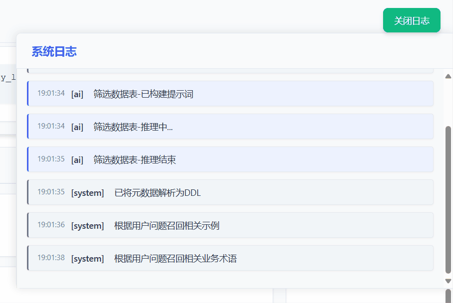
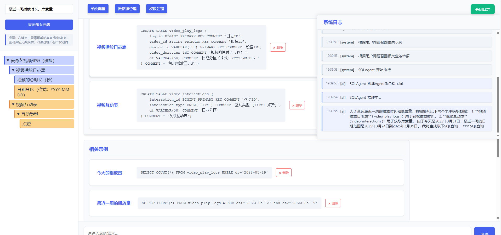

# ChatBI

## 项目简介

ChatBI 一个功能简洁的text2sql项目，由TRAE实现。


## 功能特点

### 简单的元数据接入

- 简化接入配置，比如接入元数据，比如库、表、字段、枚举值、业务术语、freeshot示例等不需要进行复杂配置。
- 包括字段备注、枚举值业务含义定义等，点赞后通过Feedback Agent自动学习并更新元数据。


### 完整实时的工作台日志

- 前端工作台通过websocket支持实时查看系统运行中的日志，工作流程完全对用户开放，方便用户快速理解系统运行逻辑，从而更快速建立自己的text2sql数据生产范式。

### 生成SQL模块采用ReAct SqlAgent

- 内置了包括数据抽样，主动扩展表、字段范围，尝试执行sql等多种工具，供AI可在持续的推理中进行调用，以生成更准确的SQL。



### 数据可视化与导出

- **多样化图表展示**：支持表格、趋势图、柱状图、圆饼图等多种数据可视化方式
- **SQL 执行确认**：生成 SQL 后可确认并执行，获取实时数据
- **便捷数据导出**：支持将查询结果导出，便于进一步分析和使用


### 主动扩展缩小元数据范围，上下文可编辑

对于复杂问题，最小充分信息原则可提高大模型理解精确性，降低幻觉风险。

- 对元数据目录可进行向量化检索，检索结果高亮显示，右键对应元数据可以主动增加或删除。
- 业务知识、术语，相关示例可以手动编辑。




## 系统要求

### 后端要求

- Python 3.8+
- SQLite 3

### 前端要求

- Node.js (推荐v14.0.0或更高版本)
- npm (推荐v6.0.0或更高版本)

## 安装步骤

### 克隆项目

```bash
git clone https://github.com/whyuds/ChatBI.git
cd ChatBI
```

### 后端安装

1. 进入后端目录

```bash
# 创建虚拟环境
python -m venv venv

# Windows激活虚拟环境
venv\Scripts\activate

```

2安装依赖包

```bash
pip install -r requirements.txt
```

### 前端安装

1安装依赖

```bash
npm install
```

## 启动应用

### 方法一：一键启动（推荐）

在项目根目录下执行以下命令，同时启动前端和后端服务：

```bash
python start.py
```

前端服务将在 http://localhost:5173 启动。

### 方法二：手动启动

#### 手动启动后端

```bash
cd backend
python app.py
```

#### 手动启动前端

```bash
cd frontend
npm start
```

## 初始化向量数据库

首次使用或更新元数据后，需要初始化向量数据库：

```
POST http://localhost:5000/vector-db/init
```

## API文档

启动后端服务后，可以通过以下地址访问Swagger API文档：

```
http://localhost:5000/apidocs/
```
